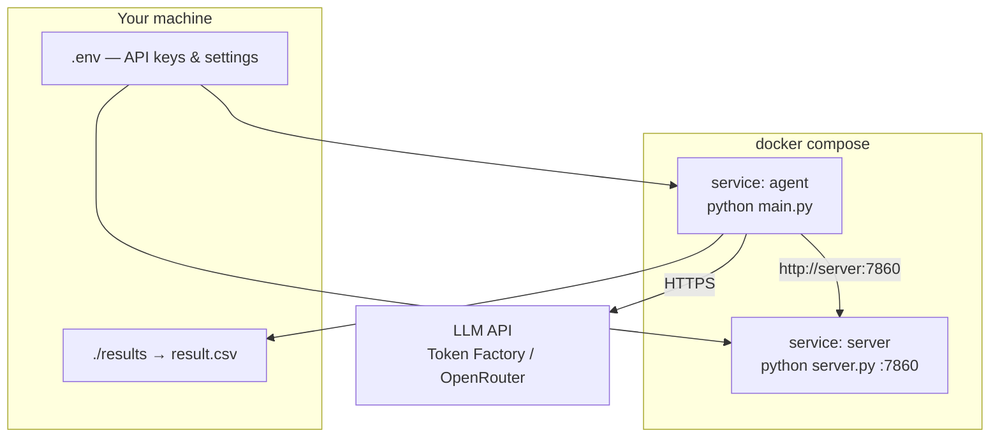

# Track A — Docker

Run the Track A tool server and agent inside Docker. No local Python venv required.

## Prerequisites

- [Docker](https://docs.docker.com/get-docker/) and Docker Compose v2
- An LLM API key (only needed when running the **agent**)

## Quick start

From the `Track A` directory:

```bash
cd "Track A"
cp .env.example .env
# Edit .env and set NEBIUS_API_KEY (or AGENT_API_KEY)
```

### 1. Start the tool server only

```bash
docker compose up --build server
```

Server is available at **http://localhost:7860**.

Smoke test:

```bash
curl -s http://localhost:7860/health
curl -s http://localhost:7860/tools | head -c 200
```

### 2. Run the agent (server + agent)

```bash
docker compose --profile agent up --build
```

This starts:

1. **`server`** — 5G simulation API on port 7860  
2. **`agent`** — runs `main.py` against `http://server:7860`, writes to `./results/`

Results appear on the host at `Track A/results/result.csv`.

### 3. Run one problem (recommended first run)

In `.env`:

```env
MAX_SAMPLES=1
NEBIUS_API_KEY=your-real-key
MODEL_NAME=Qwen/Qwen3-30B-A3B-Instruct-2507
```

Then:

```bash
docker compose --profile agent up --build
```

---

## Architecture



| Service | Command | Port | Profile |
|---------|---------|------|---------|
| `server` | `python server.py` | `7860` | default (always) |
| `agent` | `python main.py ...` | — | `agent` |

The agent container talks to the server over the Docker network (`http://server:7860`), not `localhost`.

---

## Configuration

### Environment variables (`.env`)

| Variable | Default | Purpose |
|----------|---------|---------|
| `TRACK_A_PORT` | `7860` | Host port mapped to tool server |
| `DATA_SOURCE` | `data/Phase_1` | Scenario data directory |
| `DATA_SPLIT` | `test` | `test` or `train` JSON file |
| `MODEL_URL` | Token Factory | LLM API base URL |
| `MODEL_NAME` | `Qwen/Qwen3-30B-A3B-Instruct-2507` | Model ID from your provider |
| `NEBIUS_API_KEY` | — | Token Factory key |
| `AGENT_API_KEY` | — | OpenRouter / other key |
| `MAX_SAMPLES` | `1` | Number of scenarios to run |

### Run server only (detached)

```bash
docker compose up -d server
docker compose logs -f server
docker compose down
```

### Run agent manually (server already up)

```bash
docker compose run --rm agent agent \
  --server_url http://server:7860 \
  --model_url https://api.tokenfactory.nebius.com/v1 \
  --model_name Qwen/Qwen3-30B-A3B-Instruct-2507 \
  --max_samples 1 \
  --verbose
```

Note: use `docker compose run` so the agent can reach the `server` hostname on the compose network.

### Custom agent arguments

```bash
docker compose run --rm \
  -e NEBIUS_API_KEY="$NEBIUS_API_KEY" \
  agent agent \
  --server_url http://server:7860 \
  --max_samples 5 \
  --max_iterations 15
```

---

## Dockerfile details

Single image (`track-a:latest`) used by both services:

- Base: `python:3.12-slim`
- Entrypoint: `docker/entrypoint.sh` with modes `server` | `agent`
- `UVICORN_RELOAD=false` in container (no file watcher)
- Health check: `GET /health`

Build manually:

```bash
docker build -t track-a:latest .
docker run --rm -p 7860:7860 track-a:latest server
```

Run agent against a server on the host:

```bash
docker run --rm \
  -e NEBIUS_API_KEY="your-key" \
  -v "$(pwd)/results:/app/results" \
  --add-host=host.docker.internal:host-gateway \
  track-a:latest agent \
  --server_url http://host.docker.internal:7860 \
  --model_url https://api.tokenfactory.nebius.com/v1 \
  --model_name Qwen/Qwen3-30B-A3B-Instruct-2507 \
  --max_samples 1
```

On Linux, `host.docker.internal` works with `--add-host=host.docker.internal:host-gateway` (Docker 20.10+).

---

## Troubleshooting

| Issue | Fix |
|-------|-----|
| `agent` exits immediately | Set `NEBIUS_API_KEY` in `.env` |
| LLM 401 | Key does not match `MODEL_URL` provider |
| LLM 404 | Use a model ID from your provider's `/v1/models` list |
| `connection refused` to server | Start `server` first; use `http://server:7860` inside compose |
| Empty `results/` | Agent profile not used — run with `--profile agent` |
| Port 7860 in use | Set `TRACK_A_PORT=7861` in `.env` |

---

## See also

- [`LOCAL_SETUP.md`](LOCAL_SETUP.md) — non-Docker setup, API key details
- [`README.md`](README.md) — competition overview
