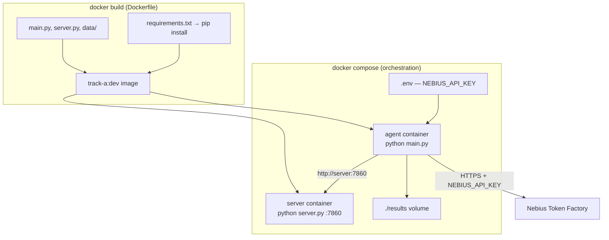

# Track A — Docker Guide (`dev` branch)

## Dockerfile vs docker-compose — which does what?

| File | Role | Analogy |
|------|------|---------|
| **`Dockerfile`** | Packages **Python code + dependencies** into one reusable image | Recipe for a boxed appliance |
| **`docker-compose.yml`** | Runs **multiple containers**, wires networking, env vars, ports, volumes | Plugging appliances together |

**You need both.** The Dockerfile does not run the app by itself; compose starts the server and agent containers from that image.



---

## Prerequisites

- Docker + Docker Compose v2
- Nebius `NEBIUS_API_KEY` ([tokenfactory.nebius.com](https://tokenfactory.nebius.com))
- Model ID from your account (`curl .../v1/models`)

---

## Quick start

```bash
cd "Track A"
cp .env.example .env
# Edit .env — set NEBIUS_API_KEY (required on dev branch)
```

### Option A — Server only (smoke test)

```bash
docker compose up --build server
```

```bash
curl http://localhost:7860/health
```

### Option B — Full pipeline (server + agent)

```bash
docker compose --profile run up --build
```

Results on the host:

```text
Track A/results/docker-run/result.csv
Track A/results/docker-run/results.json
Track A/results/docker-run.log
```

### Stop

```bash
docker compose down
```

---

## Configuration (`.env`)

| Variable | Default | Purpose |
|----------|---------|---------|
| `NEBIUS_API_KEY` | **required** | Nebius LLM API key |
| `MODEL_URL` | `https://api.tokenfactory.nebius.com/v1` | LLM endpoint |
| `MODEL_NAME` | `Qwen/Qwen3-30B-A3B-Instruct-2507` | Model from your `/v1/models` list |
| `ARCHITECTURE` | `investigator_decision` | `baseline` or `investigator_decision` |
| `DATA_SPLIT` | `train` | `train` (with labels) or `test` |
| `MAX_SAMPLES` | `10` | Number of scenarios |
| `MAX_ITERATIONS` | `15` | Tool-calling rounds per scenario |
| `SAVE_DIR` | `/app/results/docker-run` | Output dir inside container (mounted to `./results`) |
| `TRACK_A_PORT` | `7860` | Host port for tool server |

---

## Common commands

```bash
# Rebuild after code changes
docker compose build

# Server in background
docker compose up -d server

# Run agent once (server already up)
docker compose --profile run run --rm agent

# Baseline architecture instead
ARCHITECTURE=baseline MAX_SAMPLES=1 docker compose --profile run run --rm agent

# Test split, 1 scenario
DATA_SPLIT=test MAX_SAMPLES=1 docker compose --profile run up --build

# Logs
docker compose logs -f server
docker compose logs -f agent
```

---

## Manual `docker run` (without compose)

Build once:

```bash
docker build -t track-a:dev .
```

Server:

```bash
docker run --rm -p 7860:7860 -e DATA_SPLIT=train track-a:dev server
```

Agent (server on host):

```bash
docker run --rm \
  -e NEBIUS_API_KEY="your-key" \
  -v "$(pwd)/results:/app/results" \
  --add-host=host.docker.internal:host-gateway \
  track-a:dev agent \
  --server_url http://host.docker.internal:7860
```

---

## Troubleshooting

| Issue | Fix |
|-------|-----|
| `NEBIUS_API_KEY is not set` | Set in `.env` before starting agent |
| `Set NEBIUS_API_KEY in .env` (compose) | Same — compose validates at startup |
| LLM 401 / 404 | Check key + `MODEL_NAME` against `/v1/models` |
| Agent can't reach server | Use compose (`http://server:7860`), not `localhost` inside agent container |
| Empty results | Ensure `--profile run` and check `./results/` on host |

---

## See also

- [`RUN_TRACK_A.md`](RUN_TRACK_A.md) — non-Docker Nebius workflow on `dev`
- [`README.md`](README.md) — competition overview
