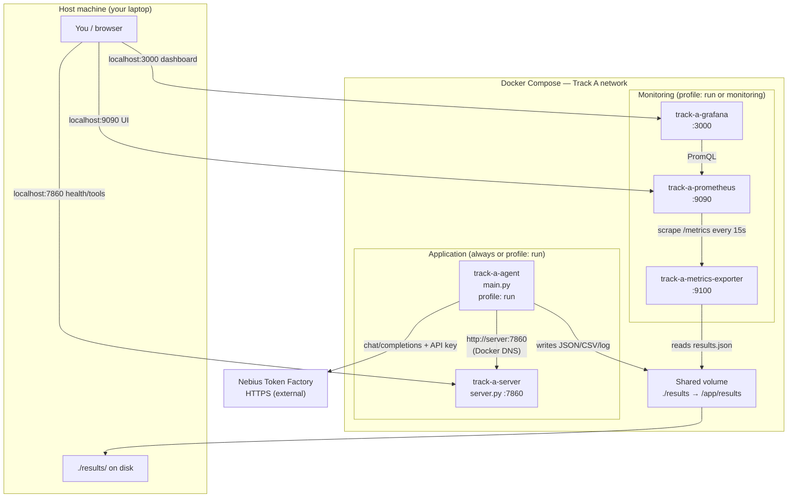
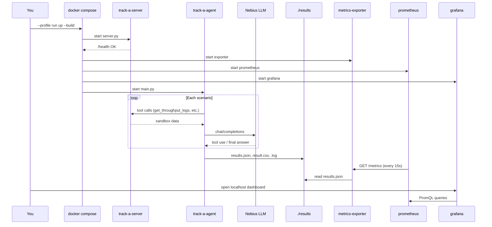

# Track A — Docker Architecture

This document explains how Track A is packaged and run in Docker: what each container does, how they connect, the commands to use, and how to fix common problems.

For a shorter quick-start, see [`DOCKER.md`](DOCKER.md). For metrics details, see [`MONITORING.md`](MONITORING.md).

---

## What Track A does (logical view)

Track A is a **telco troubleshooting benchmark**. An LLM-powered agent investigates 5G drive-test scenarios by calling tools against a frozen simulation sandbox, then submits multiple-choice answers.

| Component | File | Role |
|-----------|------|------|
| **Sandbox server** | `server.py` | FastAPI tool server — exposes 5G KPI/cell data APIs (frozen, do not edit) |
| **Agent** | `main.py` | Your editable agent — LLM tool-calling loop, scoring, result export |
| **LLM** | External | Nebius Token Factory (or OpenRouter / local vLLM) — not in Docker |
| **Results** | `./results/` | `results.json`, `result.csv`, `.log` files written by the agent |
| **Monitoring** | `monitoring/` | Exporter + Prometheus + Grafana for experiment metrics |

---

## Docker stack overview

One **Dockerfile** builds the Track A application image (`track-a:dev`). **docker-compose.yml** runs multiple containers from that image (and separate monitoring images), wires networking, mounts volumes, and maps ports to your host.



---

## Containers and profiles

Compose uses **profiles** so you can start only what you need.

| Service | Container name | Profile | Default ports (host) | Purpose |
|---------|----------------|---------|----------------------|---------|
| `server` | `track-a-server` | *(none — always eligible)* | `7860` | 5G sandbox API |
| `agent` | `track-a-agent` | `run` | — | Runs `main.py` against server + LLM |
| `metrics-exporter` | `track-a-metrics-exporter` | `run`, `monitoring` | `9100` | Parses `results/*/results.json` → Prometheus metrics |
| `prometheus` | `track-a-prometheus` | `run`, `monitoring` | `9090` | Time-series store |
| `grafana` | `track-a-grafana` | `run`, `monitoring` | `3000` | Dashboards |

### Profile cheat sheet

| Command | What starts |
|---------|-------------|
| `docker compose up server` | Sandbox only |
| `docker compose --profile run up` | Server + agent + **full monitoring** |
| `docker compose --profile monitoring up` | Monitoring only (no server/agent) |

**Normal experiment run:** use `--profile run` once. Monitoring is included automatically.

---

## Build and runtime flow



### Image build (`Dockerfile`)

1. Base: `python:3.12-slim`
2. Install `curl` (healthchecks) + `pip install -r requirements.txt`
3. Copy application code (`main.py`, `server.py`, `data/`, etc.)
4. Entrypoint: `docker/entrypoint.sh` dispatches `server` or `agent` command

### Entrypoint (`docker/entrypoint.sh`)

| Command | Runs |
|---------|------|
| `server` | `python server.py` |
| `agent` | `python main.py` with env vars (`SERVER_URL`, `MODEL_URL`, `ARCHITECTURE`, …) |

The agent container uses **`http://server:7860`** (Docker service name), not `localhost`, to reach the sandbox.

---

## File layout (Docker-related)

```text
Track A/
├── Dockerfile                 # Builds track-a:dev image
├── docker-compose.yml         # Orchestrates all services
├── docker/
│   └── entrypoint.sh          # server | agent dispatcher
├── .env.example               # Template for .env
├── results/                   # Host-mounted output (git-tracked experiment runs)
│   ├── docker-run/              # Default agent output dir
│   ├── baseline-train-10/
│   └── *.log
└── monitoring/
    ├── metrics_exporter.py
    ├── Dockerfile.exporter
    ├── prometheus.yml
    └── grafana/provisioning/  # Auto-loaded datasource + dashboard
```

---

## Step-by-step: run Track A in Docker

### Prerequisites

- Docker + Docker Compose v2
- Nebius API key from [tokenfactory.nebius.com](https://tokenfactory.nebius.com)
- A model ID available on your account (`GET /v1/models`)

### 1. Configure environment

```bash
cd ~/telco-agentic-study-o.e/Track\ A
cp .env.example .env
```

Edit `.env` and set at minimum:

```bash
NEBIUS_API_KEY=your-key-here
```

### 2. Smoke-test the sandbox (optional)

```bash
docker compose up --build server
```

In another terminal:

```bash
curl http://localhost:7860/health
```

Stop with `Ctrl+C` or `docker compose down`.

### 3. Full run (server + agent + monitoring)

```bash
docker compose --profile run up --build -d
```

Watch progress:

```bash
docker compose logs -f agent
```

### 4. Open dashboards and APIs

| Service | URL | Notes |
|---------|-----|-------|
| Grafana | http://localhost:3000 | Dashboard: **Track A — Experiment Results** |
| Prometheus | http://localhost:9090 | Raw metrics UI |
| Sandbox | http://localhost:7860/health | Tool server |
| Exporter | http://localhost:9100/metrics | Raw Prometheus text |

Grafana login: `admin` / `admin` (anonymous viewing is also enabled).

### 5. Inspect results on the host

```text
Track A/results/docker-run/results.json
Track A/results/docker-run/result.csv
Track A/results/docker-run.log
```

### 6. Stop everything

```bash
docker compose --profile run down
```

---

## Configuration reference (`.env`)

| Variable | Default | Used by | Purpose |
|----------|---------|---------|---------|
| `NEBIUS_API_KEY` | — | agent | **Required** — LLM authentication |
| `TRACK_A_PORT` | `7860` | server | Host port for sandbox |
| `DATA_SOURCE` | `data/Phase_1` | server | Scenario dataset path |
| `DATA_SPLIT` | `train` | server | `train` (with labels) or `test` |
| `MODEL_URL` | Nebius `/v1` | agent | LLM API base URL |
| `MODEL_NAME` | `Qwen/Qwen3-30B-A3B-Instruct-2507` | agent | Model ID from your account |
| `ARCHITECTURE` | `investigator_decision` | agent | `baseline` or `investigator_decision` |
| `MAX_SAMPLES` | `10` | agent | Number of scenarios |
| `MAX_ITERATIONS` | `15` | agent | Max tool-calling rounds per scenario |
| `SAVE_DIR` | `/app/results/docker-run` | agent | Output directory inside container |
| `LOG_FILE` | `/app/results/docker-run.log` | agent | Agent log path |
| `GRAFANA_PORT` | `3000` | grafana | Host port (change if 3000 is taken) |
| `PROMETHEUS_PORT` | `9090` | prometheus | Host port (change if 9090 is taken) |
| `EXPORTER_PORT` | `9100` | metrics-exporter | Host port |
| `GRAFANA_ADMIN_USER` | `admin` | grafana | Admin username |
| `GRAFANA_ADMIN_PASSWORD` | `admin` | grafana | Admin password |
| `SCRAPE_LOGS` | `true` | metrics-exporter | Parse `.log` files for LLM HTTP status |

---

## Common operations

```bash
# Rebuild after code changes
docker compose build

# Server only, background
docker compose up -d server

# Re-run agent (server already up)
docker compose --profile run run --rm agent

# Different architecture, 1 scenario
ARCHITECTURE=baseline MAX_SAMPLES=1 docker compose --profile run run --rm agent

# View logs
docker compose logs -f server
docker compose logs -f agent
docker compose logs -f grafana

# Monitoring only (existing results, no new agent run)
docker compose --profile monitoring up -d
```

---

## Networking notes

| From | To | URL / address |
|------|-----|---------------|
| Host browser | Sandbox | `http://localhost:7860` |
| Host browser | Grafana | `http://localhost:GRAFANA_PORT` |
| Agent container | Sandbox | `http://server:7860` (compose service name) |
| Agent container | LLM | `https://api.tokenfactory.nebius.com/v1` (external) |
| Grafana container | Prometheus | `http://prometheus:9090` (internal) |
| Prometheus container | Exporter | `http://metrics-exporter:9100` (internal) |

**Important:** Inside the agent container, `localhost` refers to the agent itself, not the sandbox. Compose sets `SERVER_URL=http://server:7860` correctly — do not override it with `localhost` unless you know what you are doing.

---

## Troubleshooting

### Port already allocated (`Bind for :::9090` or `:::3000`)

Another container or process is using the host port.

**Find Docker containers using the port:**

```bash
docker ps --format 'table {{.Names}}\t{{.Ports}}\t{{.Status}}' | grep 9090
docker ps --format 'table {{.Names}}\t{{.Ports}}\t{{.Status}}' | grep 3000
```

**Option A — stop the conflicting container** (if you do not need it):

```bash
docker stop <container-name>
```

**Option B — change Track A ports** in `.env` (recommended if another stack must keep running):

```bash
PROMETHEUS_PORT=9091
GRAFANA_PORT=3001
```

Then:

```bash
docker compose --profile run down
docker compose --profile run up --build -d
```

Open Grafana at **http://localhost:3001** (or whatever you set).

---

### `NEBIUS_API_KEY is not set` / compose refuses to start agent

Set the key in `Track A/.env`:

```bash
NEBIUS_API_KEY=your-key-here
```

Compose validates this at startup for the agent service.

---

### LLM `401 Unauthorized`

- API key missing or wrong in `.env`
- Key sent to wrong endpoint — on Nebius, `MODEL_URL` must be `https://api.tokenfactory.nebius.com/v1` (not OpenRouter)

---

### LLM `404` on model

Model name not available on your Nebius account. List models:

```bash
curl -s https://api.tokenfactory.nebius.com/v1/models \
  -H "Authorization: Bearer $NEBIUS_API_KEY" | jq '.data[].id'
```

Set `MODEL_NAME` in `.env` to an ID from that list.

---

### Agent cannot reach server / connection refused

| Symptom | Cause | Fix |
|---------|-------|-----|
| Agent fails immediately | Server not healthy yet | Wait for `docker compose logs server` to show healthy; agent has `depends_on: service_healthy` |
| `localhost:7860` fails inside agent | Wrong hostname in container | Use compose (`SERVER_URL=http://server:7860`), not `localhost` |
| Port conflict on host | Old `server.py` or container on 7860 | `docker compose down`; or set `TRACK_A_PORT=7861` in `.env` |

---

### Empty results / no `results.json`

- Confirm you used `--profile run` (agent profile)
- Check agent logs: `docker compose logs agent`
- Verify volume mount: results should appear under `Track A/results/` on the host
- Ensure `SAVE_DIR` in `.env` points under `/app/results/...` (mounted volume)

---

### Empty Grafana dashboard

1. Confirm result files exist: `ls Track\ A/results/*/results.json`
2. Check exporter: `curl http://localhost:9100/metrics | grep tracka_run`
3. Confirm Prometheus targets: http://localhost:9090/targets — `track-a-exporter` should be **UP**
4. Wait ~15s (scrape interval) after agent writes `results.json`

---

### Container exits immediately / unhealthy server

```bash
docker compose logs server
```

Common causes:

- Port 7860 already in use on host
- Missing or corrupt `data/` in image (rebuild: `docker compose build --no-cache server`)

Healthcheck: `curl -fsS http://127.0.0.1:7860/health` inside the container.

---

### Stale metrics after a new run

The exporter re-reads all `results.json` files on every Prometheus scrape. If data looks old:

```bash
docker compose restart metrics-exporter prometheus
```

Or hard refresh the Grafana dashboard (auto-refresh is 30s).

---

### Rebuild after code changes

```bash
docker compose build
docker compose --profile run up -d
```

If dependencies changed, force a clean build:

```bash
docker compose build --no-cache
```

---

### Nuclear reset (stop all Track A containers + volumes)

```bash
cd ~/telco-agentic-study-o.e/Track\ A
docker compose --profile run --profile monitoring down -v
```

`-v` removes named volumes (`prometheus-data`, `grafana-data`). Your `./results/` on the host is **not** deleted.

---

## Related docs

| Doc | Contents |
|-----|----------|
| [`DOCKER.md`](DOCKER.md) | Short Docker quick-start |
| [`MONITORING.md`](MONITORING.md) | Metrics catalog and monitoring-only usage |
| [`RUN_TRACK_A.md`](RUN_TRACK_A.md) | Non-Docker workflow with venv |
| [`LOCAL_SETUP.md`](LOCAL_SETUP.md) | Initial environment setup |
| [`README.md`](README.md) | Competition overview |
