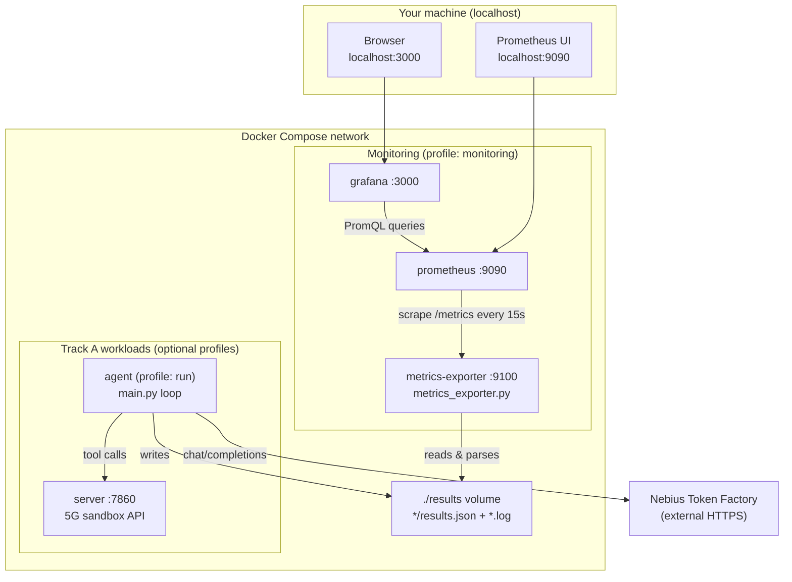

# Track A — Monitoring (Prometheus + Grafana)

Experiment metrics are exported from every `results.json` under `Track A/results/` (including nested run folders like `baseline-train-10/results.json`).

## Quick start

```bash
cd "Track A"

# Monitoring only (reads committed results on disk)
docker compose --profile monitoring up --build -d

# Server + agent + monitoring together
docker compose --profile run --profile monitoring up --build -d
```

Open in your browser:

| Service | URL | Default login |
|---------|-----|---------------|
| **Grafana dashboard** | http://localhost:3000/d/track-a-results/track-a-experiment-results | `admin` / `admin` (or anonymous view) |
| Prometheus | http://localhost:9090 | — |
| Metrics exporter | http://localhost:9100/metrics | — |

The **Track A — Experiment Results** dashboard is auto-provisioned under the **Track A** folder.

---

## How the full stack fits together



### Data flow

1. **Agent runs** (optional) call the sandbox server and Nebius LLM, writing `results/<run>/results.json` and companion `results/<run>.log` files.
2. **metrics-exporter** scans `RESULTS_DIR` on each Prometheus scrape:
   - `results.json` and `*/results.json`
   - optional `*.log` files for LLM HTTP status counts
3. **Prometheus** pulls gauges from the exporter (`tracka_run_avg_accuracy`, `tracka_scenario_latency_seconds`, etc.).
4. **Grafana** displays the pre-built dashboard from `monitoring/grafana/provisioning/`.

---

## Metrics reference

| Metric | Labels | Description |
|--------|--------|-------------|
| `tracka_scenario_accuracy` | run, scenario_id, architecture, model | Per-scenario score (0–1) |
| `tracka_scenario_latency_seconds` | run, scenario_id, architecture, model | End-to-end latency |
| `tracka_scenario_tool_calls` | run, scenario_id, architecture, model | Tool calls per scenario |
| `tracka_run_avg_accuracy` | run, architecture, model | Mean accuracy for a run |
| `tracka_run_avg_latency_seconds` | run, architecture, model | Mean latency for a run |
| `tracka_run_avg_tool_calls` | run, architecture, model | Mean tool calls per scenario |
| `tracka_run_total_failed_tools` | run, architecture, model | Failed tool invocations |
| `tracka_run_info` | run, architecture, model, model_url | Value = scenario count |
| `tracka_llm_requests` | run, status | HTTP status counts from logs |
| `tracka_exporter_results_files_loaded` | — | Files discovered on last scrape |

---

## Configuration

Environment variables (`.env` or shell):

| Variable | Default | Purpose |
|----------|---------|---------|
| `GRAFANA_PORT` | `3000` | Grafana host port |
| `GRAFANA_ADMIN_USER` | `admin` | Grafana admin username |
| `GRAFANA_ADMIN_PASSWORD` | `admin` | Grafana admin password |
| `PROMETHEUS_PORT` | `9090` | Prometheus host port |
| `EXPORTER_PORT` | `9100` | Exporter host port |
| `SCRAPE_LOGS` | `true` | Parse companion `.log` files |

---

## Local development (without Docker)

```bash
cd "Track A"
python3 -m venv .venv && source .venv/bin/activate
pip install -r monitoring/requirements.txt

RESULTS_DIR=./results EXPORTER_PORT=9100 python monitoring/metrics_exporter.py
# curl http://localhost:9100/metrics
```

Run Prometheus and Grafana via compose while developing the exporter locally:

```bash
docker compose --profile monitoring up prometheus grafana -d
```

---

## Troubleshooting

| Symptom | Check |
|---------|-------|
| Empty dashboard | Confirm `Track A/results/*/results.json` exist; visit http://localhost:9100/metrics |
| Grafana login fails | Default `admin`/`admin`; change via `GRAFANA_ADMIN_PASSWORD` |
| No log metrics | Ensure `results/<run-name>.log` sits beside the run folder |
| Stale data | Exporter reloads on each scrape; Prometheus interval is 15s |
